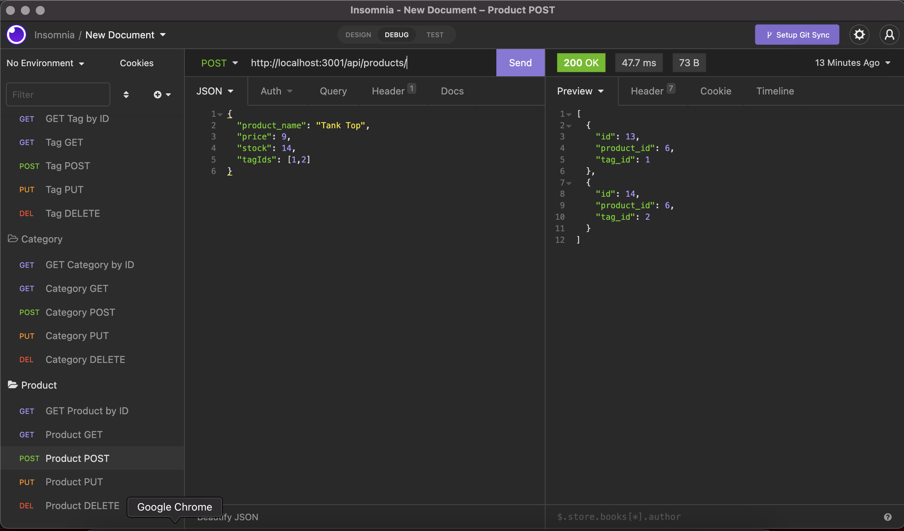
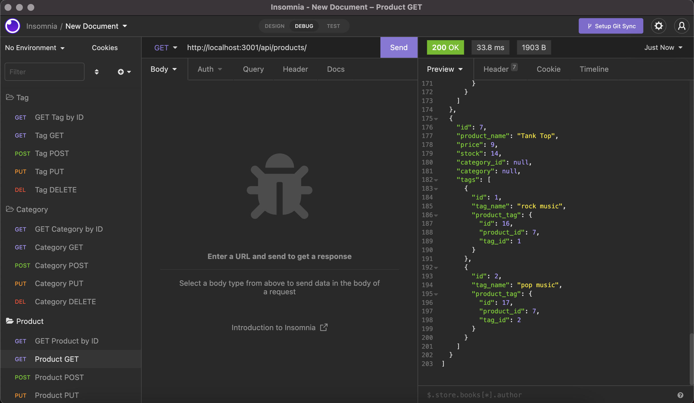

# employee-tracker

## User Story
AS A manager at an internet retail company

I WANT a back end for my e-commerce website that uses the latest technologies

SO THAT my company can compete with other e-commerce companies

## Usage
From the command line the user will go into MySQL shell by entering `mysql -uroot -p` and providing their password when prompted. The user will then create the database by running `source file-path/file-name`. In this case, `source db/schema.sql`. Then exit MySQL shell with `\q`.

The database can be seeded by running `npm run seed`.

The server can then be started with `npm start`.

In Insomnia the user can GET all the routes for the full databases by using the URL http://localhost:3001/api/ + either "tags", "products" or categories. The user can also add "/:id" to the end of the URL to view a specific ID. They then have the option to add (POST), update (PUT) or delete (DELETE) an ID.

## Walkthrough Videos
Command Line
https://drive.google.com/file/d/1B95GFDIseIMGVyRSc6hCX7lAx61qBNu5/view?usp=sharing

GET Routes
https://drive.google.com/file/d/1W7GQFv8xoAM6kvRhng08KjlatavM7Hel/view?usp=sharing

GET by ID Routes
https://drive.google.com/file/d/11Yb0AyocgOizlyfQUM9gNaUGIb4e_VLg/view?usp=sharing

POST PUT DELETE Routes
https://drive.google.com/file/d/1aVlkrpBdCCraljYLmBw_uO2wHVFb5U-f/view?usp=sharing 

## Preview of application

## Packages Used
mySQL2 Package

Sequelize

dotenv package

## GitHub Repository
https://github.com/randronaco1027/ecommerce_backend